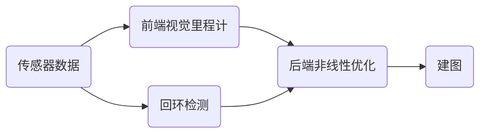

## 一、SLAM 的误差来源

SLAM 的本质是一类状态估计问题，需要同时估计连续量和离散量

- 连续状态：是机器人运动时候的位姿和环境中位姿的特征

- 离散状态：当前观测数据中，检测到的物体和已检测过的物体之间的对应关系（实质是前端做的事情）

**但是传感器的误差和机器人运动中误差的积累使得建图算法得到的环境模型和实际模型之间 产生了难以消除的误差**

因此，视觉数据的优化过程就是在观测的数据中心筛选出更为有效的数据，从而降低计算量以及减小误差，也就是由于误差的存在也就产生了优化的算法

## 二、SLAM 领域涉及的五个关键性问题

- **地图的表示方法**

- **不确定信息处理**

- **信息的关联**

- **机器人的自定位**

- **探索规划**

针对上述的 SLAM 问题，其中基于概率的 SLAM 方法得到了广泛应用，主要包括

- **马尔科夫定位法** （可以在初始位姿不确定的情况下确定机器人的位置，解决机器人的绑架问题，但是计算量非常大，实时性差，不 能用于大规模的位置环境）
- **蒙特卡洛定位法**（粒子滤波法）（可以应用在非线性和非高斯的系统中，而且精度很高，但是也存在的粒子退化耗尽的问题）
- **稀疏拓展滤波法**
- **卡尔曼滤波法** （解决离散数据的线性滤波方法）

## 三、经典的视觉 SLAM 框架

经典的 SLAM 框架主要由两条主线同时进行：

- **传感器的信息读取** 在视觉 SLAM 中主要为相机图像信息的读取和预处理，如果在机器人中还能够有码盘、观星传感器等信息的读取和同步。

- **视觉里程计（VO）** 视觉里程计的任务是估算相邻图像见相机的运动，以及局部地图的样子， 又称为前端（Front end）。只能计算相邻时刻的运动，而和往前的信息没有任何关联。仅仅利用视觉里程计来估计轨迹，将不可避免的出现累积漂移，这是视觉里程计只关注相邻两图像之间的运动所造成的

- **后端优化(Optimization)** 后端接受不同时刻视觉里程计测量的相机位姿，以及回环检测的信息，对它们进行优化，得到全局一致的轨迹和地图。后端优化主要处理 SLAM 过程中的噪声问题，后端优化考虑的问题，就是如何从带有噪声的数据当中，估计整个系统的状态，以及这个状态估计的不确定性有多大——这也成为最大后验概率估计。

**SLAM 问题的本质，就是对运动物体自身和周围环境的不确定性估计**，为了解决 SLAM 问题，我们需要状态估计理论，把定位和建图的不确定性表达出来，然后通过采用滤波器或者非线性优化，去估计状态的均值和不确定性（方差）

> **在视觉 SLAM 中，前端视觉里程计和计算机视觉研究的领域更为相关，比如图像的特征提取和匹配等，后端主要是滤波和非线性优化算法**

- **回环检测(Loop Closing)** 会还金策判断机器人是否曾经到过之前到过的位置，如果检测到到过曾经到过的地方，就会把信息交给后端进行处理。

  ​ 主要的方法就是计算图像数据之间相似性的算法

- **建图(Mapping)** 它根据估计的轨迹，建立与任务要求对应的地图。

## 四、SLAM 的数学描述、运动方程和观测方程

### SLAM 问题的数学描述

- ==运动方程==

  $$x_k=f(x_{k-1},u_k,w_k)$$

  ​ 其中$x_k$是 k 时刻机器人的位置，$x_{k-1}$是$k-1$时刻机器人的位置，$u_k$是 k 时刻传感器的数据，$w_k$为噪声，所以，我们要考虑的问题就是从 k-1 时刻到 k 时刻，机器人的位置是怎么变化的。

  ​ 通常，机器人会携带一个测量自身运动的传感器，比如码盘或者惯性传感器，这个传感器可以测量有关运动的读数

- ==观测方程==

  $$z_{k,j}=h(y_j,x_k,v_{k,j})$$

  ​ 假设机器人在 k 时刻，在$x_k$处探测到了某一个路标点$y_i$，产生了一个观测数据$z_{k,j}$，用一个抽象的函数来表达这个关系，就是观测方程，$v_{k,j}$是其中的噪声

针对不同的传感器，这两个方程有不同的参数化形式。

当我们知道运动测量的度数$u$，以及传感器的读数$z$的时候，如何求解定位问题（估计 x）和建图问题（估计 y）？这个时候我们把 SLAM 为建模成了一个状态估计问题：如何通过带有噪声的测量数据，估计内部的隐藏着的状态变量？

状态估计问题的求解，和两个方程的具体形式，以及噪声服从哪种分布有关。

## 五、非线性优化

> 这里是 SLAM 视觉 14 讲第六节一些想法，顺便和前面学过的一些理论做一些结合

### 回顾

- 之前讲到的三维世界中刚体运动的描述：旋转矩阵、旋转向量、欧拉角、四元数实质上都是对$x_k$的描述，怎么样确定相机坐标系和世界坐标系的联系，也可以用李代数来描述

- 观测模型是可以用相机投影的观测模型来确定

- 而这一章我们的要研究的问题就是怎么由传感器参数$u_k$和观测参数$z_{k,j}$来对估计值$x_k$进行优化

### 状态估计问题

$$x_{k}=f(x_{k-1},{u_k})+w_k$$

$$z_{k,j}=h(y_{j},x_{k})+v_{k,j}$$

其中$x_k=T_k=exp(\xi_k)$用李群李代数来表示，z 为像素值

$$sz_{k,j}=K exp(\xi)y_j$$

最简单的情况：线性系统，高斯噪声，复杂的情况，非线性系统，非高斯噪声

## 六、总结

由于**噪声**的存在，当我们把估计的轨迹与地图代入 SLAM 的运动、观测方程中时，它们并不会完美的成立，那么我们就**调整状态的估计，使得误差最小化**

## SLAM 知识树

