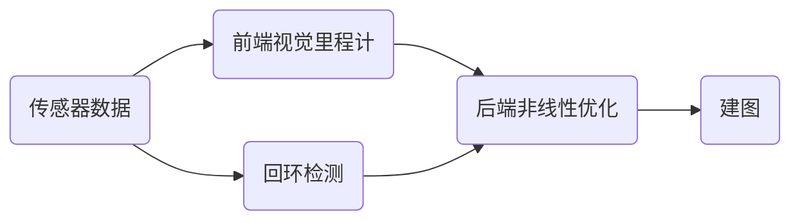

## 一、SLAM 的误差来源

SLAM 的本质是一类状态估计问题，需要同时估计连续量和离散量

- 连续状态：是机器人运动时候的位姿和环境中位姿的特征

- 离散状态：当前观测数据中，检测到的物体和已检测过的物体之间的对应关系（实质是前端做的事情）

**但是传感器的误差和机器人运动中误差的积累使得建图算法得到的环境模型和实际模型之间 产生了难以消除的误差**

因此，视觉数据的优化过程就是在观测的数据中心筛选出更为有效的数据，从而降低计算量以及减小误差，也就是由于误差的存在也就产生了优化的算法

## 二、SLAM 领域涉及的五个关键性问题

- **地图的表示方法**

- **不确定信息处理**

- **信息的关联**

- **机器人的自定位**

- **探索规划**

针对上述的 SLAM 问题，其中基于概率的 SLAM 方法得到了广泛应用，主要包括

- **马尔科夫定位法** （可以在初始位姿不确定的情况下确定机器人的位置，解决机器人的绑架问题，但是计算量非常大，实时性差，不 能用于大规模的位置环境）
- **蒙特卡洛定位法**（粒子滤波法）（可以应用在非线性和非高斯的系统中，而且精度很高，但是也存在的粒子退化耗尽的问题）
- **稀疏拓展滤波法**
- **卡尔曼滤波法** （解决离散数据的线性滤波方法）

## 三、经典的视觉 SLAM 框架

经典的 SLAM 框架主要由两条主线同时进行：

- **传感器的信息读取** 在视觉 SLAM 中主要为相机图像信息的读取和预处理，如果在机器人中还能够有码盘、观星传感器等信息的读取和同步。

- **视觉里程计（VO）** 视觉里程计的任务是估算相邻图像见相机的运动，以及局部地图的样子， 又称为前端（Front end）。只能计算相邻时刻的运动，而和往前的信息没有任何关联。仅仅利用视觉里程计来估计轨迹，将不可避免的出现累积漂移，这是视觉里程计只关注相邻两图像之间的运动所造成的

- **后端优化(Optimization)** 后端接受不同时刻视觉里程计测量的相机位姿，以及回环检测的信息，对它们进行优化，得到全局一致的轨迹和地图。后端优化主要处理 SLAM 过程中的噪声问题，后端优化考虑的问题，就是如何从带有噪声的数据当中，估计整个系统的状态，以及这个状态估计的不确定性有多大——这也成为最大后验概率估计。

**SLAM 问题的本质，就是对运动物体自身和周围环境的不确定性估计**，为了解决 SLAM 问题，我们需要状态估计理论，把定位和建图的不确定性表达出来，然后通过采用滤波器或者非线性优化，去估计状态的均值和不确定性（方差）
